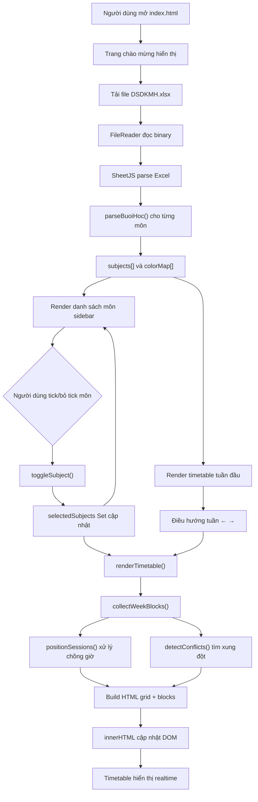
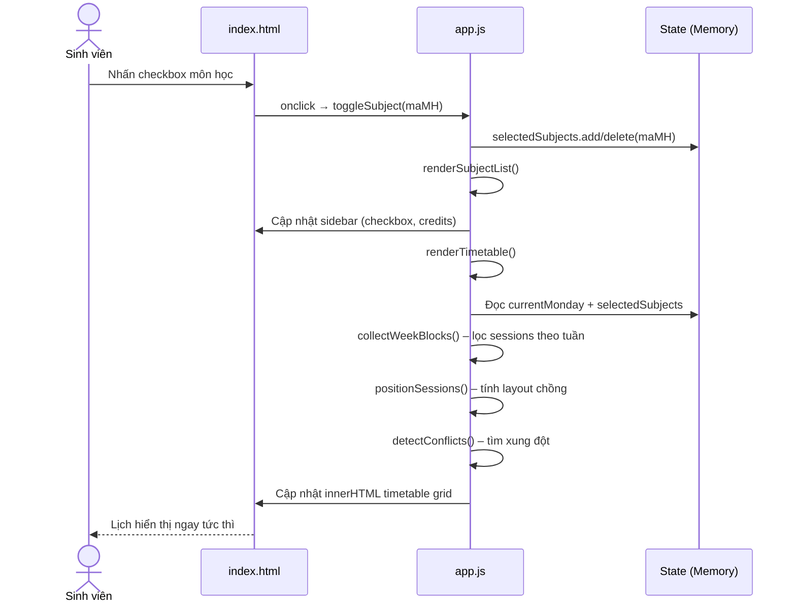
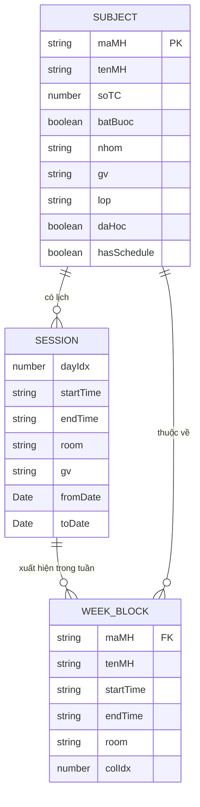

# Kiến trúc hệ thống – Visual TKB DMU

---

## 1. Tổng quan hệ thống

**Visual TKB** là ứng dụng web tĩnh (static web app) chạy hoàn toàn phía trình duyệt (client-side only), không có backend, không có database. Mục đích cốt lõi là giúp sinh viên Đại học Mở TP.HCM (DMU) **trực quan hóa thời khóa biểu** và **lên kế hoạch đăng ký môn học** trước khi đăng ký chính thức, bằng cách parse file Excel xuất từ hệ thống nhà trường.

**Luồng giá trị chính:**
> Sinh viên tải file Excel → chọn/bỏ chọn môn → xem ngay thời khóa biểu preview → phát hiện xung đột → quyết định đăng ký

---

## 2. Công nghệ sử dụng

| Thành phần | Công nghệ | Ghi chú |
|-----------|-----------|---------|
| Cấu trúc | HTML5 (Semantic) | Single-page, không framework |
| Giao diện | Vanilla CSS | CSS Variables, Grid, Flexbox (Light theme) |
| Logic | Vanilla JavaScript (ES2020) | Không framework, không build step |
| Đọc Excel | [SheetJS xlsx 0.20.3](https://cdn.sheetjs.com) | Tải qua CDN |
| Font chữ | [Inter – Google Fonts](https://fonts.google.com/specimen/Inter) | Tải qua CDN |
| Định dạng dữ liệu | `.xlsx` (Excel Open XML) | File xuất từ hệ thống DMU |

---

## 3. Cấu trúc thư mục

```
VisualTKBTDMU/
├── index.html          # Entry point – toàn bộ HTML layout
├── style.css           # Design system – dark theme, timetable grid
├── app.js              # Application logic – parse, render, state
├── DSDKMH.xlsx         # File dữ liệu mẫu (Danh sách đăng ký môn học)
├── README.md           # Hướng dẫn sử dụng
└── docs/
    ├── architecture.md # Tài liệu kiến trúc (file này)
    └── CHANGELOG.md    # Nhật ký thay đổi
```

---

## 4. Kiến trúc thành phần

Ứng dụng là **Single-Page Application thuần túy** gồm 3 lớp:

```
┌─────────────────────────────────────────────┐
│              PRESENTATION LAYER              │
│   index.html  ←→  style.css                 │
│   - Sidebar (upload + subject list)          │
│   - Timetable grid (week view)               │
│   - Week navigation controls                 │
└─────────────────────────────┬───────────────┘
                              │ DOM manipulation
┌─────────────────────────────▼───────────────┐
│              APPLICATION LAYER               │
│                  app.js                      │
│   State: subjects[], selectedSubjects Set    │
│   - parseExcel()     – SheetJS → objects     │
│   - parseBuoiHoc()   – chuỗi → sessions     │
│   - renderSubjectList() – cập nhật sidebar   │
│   - renderTimetable()   – hiển thị trục Tiết │
│                           1-16 & auto refit  │
│   - startTimeToTiet()  – map giờ → Tiết      │
│   - detectConflicts()   – phát hiện trùng   │
│   - positionSessions()  – xử lý chồng lịch  │
│   - window.resize       – auto refit height  │
└─────────────────────────────┬───────────────┘
                              │ FileReader API
┌─────────────────────────────▼───────────────┐
│                DATA LAYER                    │
│   DSDKMH.xlsx  →  SheetJS (CDN)             │
│   - Đọc bằng FileReader (browser API)        │
│   - Parse binary → JSON rows                 │
│   - Không có server, không có database       │
└─────────────────────────────────────────────┘
```

---

## 5. Luồng dữ liệu

### Luồng tải và khởi tạo:
1. Người dùng chọn file `.xlsx` qua upload area (drag-drop hoặc click)
2. `FileReader.readAsArrayBuffer()` đọc file thành binary
3. `XLSX.read()` (SheetJS) parse binary → workbook object
4. `XLSX.utils.sheet_to_json()` chuyển sheet đầu tiên → mảng rows
5. Mỗi row được map thành object `Subject` với các trường:
   - `maMH`, `tenMH`, `soTC`, `batBuoc`, `nhom`, `gv`, `sessions[]`, `daHoc`
6. `parseBuoiHoc()` parse chuỗi "Buổi học" nhiều dòng → mảng `Session`:
   ```
   "Thứ 3,từ 09:45 đến 12:15,Ph I4.313,GV Nguyễn Đình Thọ,20/10/26 đến 17/11/26"
   → { dayIdx: 2, startTime: "09:45", endTime: "12:15", room, gv, fromDate, toDate }
   ```
7. Màu sắc được gán tuần hoàn (12 màu) qua `colorMap[maMH]`
8. Môn đã có `x` trong cột Học → tự động vào `selectedSubjects Set`

### Luồng render timetable:
1. Từ `currentMonday` → tính 7 ngày của tuần (Thứ 2 → Chủ Nhật)
2. Duyệt qua `subjects` → lọc những môn trong `selectedSubjects`
3. Với mỗi session, kiểm tra `sessionOccursOnDate(session, date)`:
   - Đúng ngày trong tuần (dayIdx khớp)
   - Ngày nằm trong khoảng `[fromDate, toDate]`
4. `positionSessions()` xử lý các block trùng giờ trong cùng một cột:
   - Thuật toán Greedy Interval Scheduling: phân các session vào "slot" con
   - Tính `leftPct` và `widthPct` để hiển thị song song
5. `detectConflicts()` so sánh tất cả cặp sessions cùng cột:
   - Xung đột khi `startA < endB && endA > startB` (khác môn)
   - Trả về Set các key xung đột để đánh dấu block
6. Build HTML string → `innerHTML` của `#timetable-grid`

---

## 6. Cơ chế bảo mật

| Khía cạnh | Chi tiết |
|-----------|---------|
| **Xử lý dữ liệu** | 100% client-side — dữ liệu không rời khỏi trình duyệt |
| **Không server** | Không có API endpoint, không có network request với dữ liệu người dùng |
| **File Excel** | Đọc bằng `FileReader` browser API — không upload lên server nào |
| **CDN** | SheetJS và Google Fonts được tải từ CDN bên ngoài (không có dữ liệu gửi đi) |
| **XSS** | Tên môn học được nhúng vào HTML string — cần lưu ý nếu mở rộng với dữ liệu từ API |

---

## 7. APIs / Hàm cốt lõi

| Hàm | Mô tả |
|-----|-------|
| `parseExcel(file)` | Async, đọc File → trả về `Subject[]` |
| `parseBuoiHoc(str)` | Sync, parse chuỗi nhiều dòng → `Session[]` |
| `renderTimetable()` | Render toàn bộ grid theo `currentMonday` + `selectedSubjects` |
| `renderSubjectList()` | Render sidebar + cập nhật thống kê tín chỉ |
| `toggleSubject(maMH)` | Toggle chọn/bỏ môn → gọi cả 2 render functions |
| `positionSessions(blocks)` | Tính `leftPct`/`widthPct` cho sessions chồng giờ |
| `detectConflicts(weekBlocks)` | Trả về `Set<string>` các key xung đột |
| `timeToPx(hhmm)` | Chuyển "HH:MM" → pixel offset từ đỉnh grid |
| `getMonday(date)` | Tính ngày Thứ 2 của tuần chứa date |

---

## 8. Sơ đồ trực quan

### Sơ đồ luồng hệ thống (Flowchart)



### Sơ đồ tuần tự – Toggle môn học (Sequence Diagram)



### Sơ đồ cấu trúc dữ liệu (ER Diagram)


